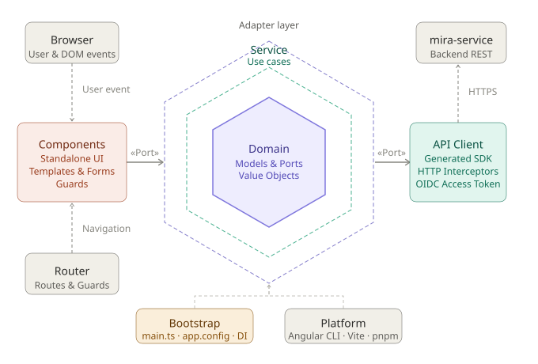

# mira-website


## Architecture

The frontend follows a **hexagonal architecture** (Ports & Adapters), applied
*feature-first*: each feature is a vertical slice that separates a pure domain
core from application services and from the adapters that reach the outside
world.



| Ring | Role | In this codebase |
|------|------|------------------|
| **Domain** (core) | Framework-free models, value objects and **port** interfaces | `<feature>/domain/` — e.g. `AuthUser`, `Os`/`DownloadTarget`, `LegalDocument`, pure `os-detection` logic |
| **Application** (use cases) | Services that orchestrate the domain and depend **only on ports** | `<feature>/application/` — e.g. `AuthService`, `DownloadService`, `ClientSettingsService` |
| **Adapters** | Inbound (driving) and outbound (driven) | `<feature>/adapters/ui/` components & the router (inbound); `.../gateway`, `.../identity` HTTP/SDK/browser adapters (outbound) |

**Dependency inversion happens at the ports.** An application service never
imports the generated SDK or `HttpClient` directly — it depends on an interface
plus an Angular `InjectionToken`, and an outbound adapter supplies the concrete
implementation. This is the pattern the settings feature already established with
`CLIENT_SETTINGS_API`.

| Feature | Outbound port | Adapter implementation |
|---------|---------------|------------------------|
| `auth` | `IdentityProviderPort` · `TokenStoragePort` · `AuthApiPort` | Keycloak / token-storage / SDK adapters |
| `download` | `VersionGatewayPort` · `DownloadGatewayPort` | HTTP version + browser download adapters |
| `legal` | `LegalDocumentGatewayPort` | HTTP documents adapter (bundled dummy fallback) |
| `settings` | `ClientSettingsApi` | `/api/me/settings` SDK adapter |

The shared HTTP infrastructure (`api-client.ts`, generated `src/api/**`) and the
composition root (`app.config.ts`, `main.ts`) wire the adapters to their ports at
bootstrap. The bundled desktop client (`webui`) and the `mira-service` backend
sit *outside* the hexagon — the frontend only talks to them through its adapters.

> The backend service (`mira-service`) has its own, separate hexagonal diagram.

### Project Structure

Each feature is a vertical slice. Features that carry logic (`auth`, `download`,
`legal`, `settings`) split into `domain/` · `application/` · `adapters/`;
purely presentational features (`home`, `layout`, `placeholder`) are inbound-
adapter components and stay flat.

```
src/app/
  auth/                     # identity & session (fully inverted)
    domain/                 #   models.ts · ports.ts (IdentityProvider, TokenStorage, AuthApi)
    application/            #   auth.service.ts
    adapters/
      ui/                   #   auth-page
      identity/             #   keycloak · storage · config + the 3 port adapters
  download/
    domain/                 #   models.ts · os-detection.ts (pure) · ports.ts
    application/            #   download.service.ts
    adapters/
      ui/                   #   download-button · os-modal
      gateway/              #   http-version · browser-download
  legal/
    domain/ application/    #   models.ts · ports.ts · legal.service.ts (+ dummy fallback)
    adapters/ui|gateway/    #   legal-page · http-legal
  settings/
    domain/ application/    #   ports.ts · client-settings · theme · wallpaper services
    adapters/ui|gateway/    #   user-settings · client-settings-api
  home/ jobs/ layout/ placeholder/   # inbound-adapter pages (jobs has a small domain/)
  shared/                   # shared kernel: reveal, date-picker, event-carousel, community
  api-client.ts             # shared outbound HTTP infrastructure (interceptors, token)
  app.config.ts · main.ts   # composition root — wires adapters to ports
```

## Branch Strategy

| Branch         | Purpose                                                                                    |
|----------------|--------------------------------------------------------------------------------------------|
| `master`       | Production branch — stable checkpoints only (completed features, releases)                 |
| `development`  | Integration branch — finished feature branches get merged here                             |
| `feature/...`  | Feature branches — all development happens here, always branch off `development`           |
| `bugfix/...`   | Bugfix branches — fixes are developed here, always branch off `development`                |
| `refactor/...` | Refactor branches — refactoring happens here, always branch off `development`              |

### Normal Workflow

```bash
# 1. Create a new branch off development (include ticket number if available)
git checkout development
git checkout -b feature/my-feature-123

# 2. Develop & commit
git add .
git commit -m "feat: my feature"

# 3. Merge feature branch into development (when feature is done)
git checkout development
git merge feature/my-feature-123 --no-ff
git push origin development

# 4. Clean up the feature branch
git branch -d feature/my-feature-123

# 5. Only when a major milestone is reached → merge development into master // only Lead Dev
git checkout master
git merge development --no-ff -m "release: Checkpoint vX.X"
git push origin master
```

**Rule:** Never commit directly to `master` or `development`. All work starts on a dedicated branch branched off `development`.

### Accidentally pushed to master?

Run the backmerge script to merge `master` back into `development`:

```bash
bash scripts/backmerge-master-to-development.sh
```

## Setup (required for every developer)

After cloning the repo, run this once to activate the Git hooks:

```bash
git config core.hooksPath .githooks
```

This prevents accidental direct pushes to `master`.

## Node version

This project requires **Node.js v24.17.0** (Angular CLI 22 needs ≥ v24.15.0).
The version is pinned in [`.node-version`](.node-version), so any Node manager
that reads it (fnm, nvm, asdf, Volta) picks the right version automatically.

## Troubleshooting

### `node.exe` was not recognized / `CommandNotFoundException` when running `ng`, `pnpm` or `node`

Node is managed by [**fnm**](https://github.com/Schniz/fnm) and is not on the
`PATH` until fnm is activated in your shell. If a fresh terminal can't find
`node`/`pnpm`/`ng`, your shell profile isn't activating fnm.

**PowerShell (permanent fix)** — add this line to your profile
(`$PROFILE`, e.g. `C:\Users\<you>\Documents\WindowsPowerShell\Microsoft.PowerShell_profile.ps1`):

```powershell
fnm env --use-on-cd | Out-String | Invoke-Expression
```

Open a new terminal afterwards. `--use-on-cd` also auto-switches to the version
in `.node-version` whenever you `cd` into the project. For a one-off session you
can instead prepend the install dir manually:

```powershell
$env:Path = "$env:APPDATA\fnm\node-versions\v24.17.0\installation;" + $env:Path
```

(Bash/Zsh users add `eval "$(fnm env --use-on-cd)"` to `~/.bashrc` / `~/.zshrc`.)

### `The Angular CLI requires a minimum Node.js version of v24.15.0`

Your active Node is too old (fnm's default is often an older v22). From inside
the project run `fnm use` to switch to the pinned `.node-version`, or set it as
the default with `fnm default v24.17.0`. Install it first if missing:
`fnm install v24.17.0`.

## Development Server

To start a local development server, run:

```bash
pnpm start
```

Once the server is running, open your browser and navigate to `http://localhost:4200/`. The application will automatically reload whenever you modify any of the source files.

For local API backends, prefer this:

```bash
pnpm run start:local
```

`start:local` refreshes the generated OpenAPI client against local services on `8080/8081/...` and starts `ng serve`.

For remote/dev API mode, use:

```bash
pnpm run start:dev
```

## Code Scaffolding

Angular CLI includes powerful code scaffolding tools. To generate a new component, run:

```bash
ng generate component component-name
```

For a complete list of available schematics (such as `components`, `directives`, or `pipes`), run:

```bash
ng generate --help
```

## Building

To build the project run:

```bash
ng build
```

This will compile your project and store the build artifacts in the `dist/` directory. By default, the production build optimizes your application for performance and speed.

## Generating API Client

To refresh the generated OpenAPI client from the shared API definitions, run:

```bash
pnpm run generate:api
```

To use local OpenAPI endpoints (e.g. during backend development), run:

```bash
pnpm run generate:local:api
```

Generated clients are written to `src/api`.

## Running Unit Tests

To execute unit tests with the [Vitest](https://vitest.dev/) test runner, use the following command:

```bash
pnpm run test
```

The CI pipeline runs `pnpm run test:ci` and enforces a minimum coverage threshold of **90%** (lines, branches, functions, statements) before deployment.

## Running End-to-End Tests

For end-to-end (e2e) testing, run:

```bash
pnpm run test:e2e
```

## Deployment

The CI builds the website container and publishes it to GHCR. It does not access
deployment hosts or Kubernetes clusters. K3s deployment and the GitOps handover
are documented in [docs/deployment-k3s.md](docs/deployment-k3s.md).

The current deployment is a temporary S-TEST setup. All non-local browser
requests still use the shared API and Keycloak endpoints at
`https://api.tilt-us.com` and `https://api.tilt-us.com/keycloak`. R-TEST and
PROD must not be rolled out from this website CI until separate backend
environments and public runtime configuration are available.
